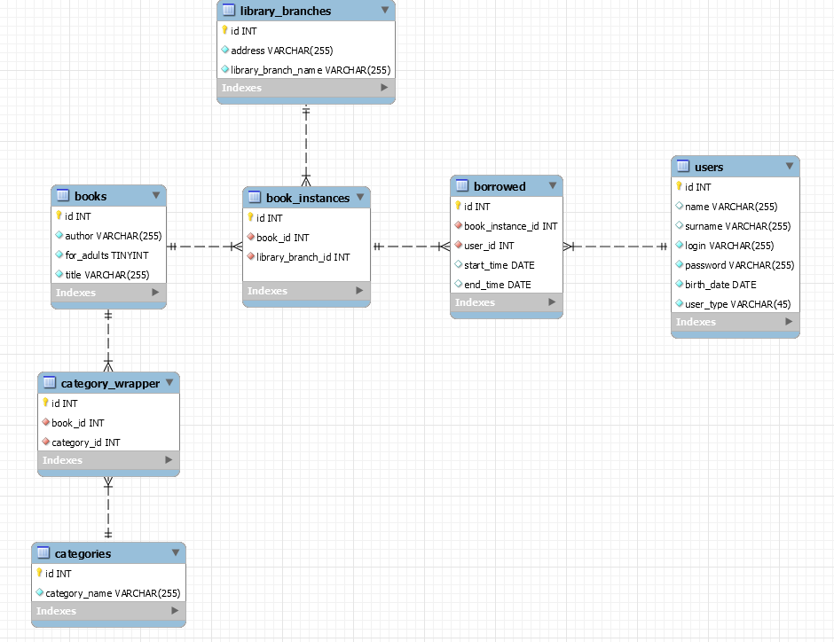

# This directory contains database dump and its short description
## EER Diagram of DB

## Table of Contents
- [Triggers](#triggers)
  * [can_user_borrow](#can_user_borrow)
- [Functions](#functions)
  * [cash_penalty](#cash_penalty)
- [Procedures](#procedures)
  * [add_new_book](#add_new_book)
  * [calculate_cash_penalty](#calculate_cash_penalty)
  * [check_availability](#check_availability)
  * [delete_books](#delete_books)
  * [get_books_by_category](#get_books_by_category)
  * [get_books_filter](#get_books_filter)
  * [get_category_of_book](#get_category_of_book)
  * [get_users_books](#get_users_books)

## Triggers
* ##### can_user_borrow
    This is `BEFORE INSERT` type trigger which prevents from a situation when user can borrow a new book when he is behind with the previous ones. In this case the trigger returns list of ids of books, which need to be returned.
    It also limits maximum the number of books rented at the same time to 5. Uppon successful insert the return date is set to `sysdate + 14`.

## Functions
* ##### cash_penalty
    This functions calculates how much money the reader owes to the library. Book penalty equals difference in days between return date and now, multiplied by a 0.25. Total penalty is the sum of book penalties. 
    Input arguments:
    + login:`VARCHAR(255)`, login of the user for whom the penalty is to be calculated 

## Procedures
* ##### add_new_book
    This procedure adds a new book to the library 
    Input parameters:
    + book_title: `VARCHAR(255)`, new book's title
    + book_author: `VARCHAR(255)`, new book's author
    + for_adults: `TINYINT`, age restriction flag, 1 means 'for adults', 0 'for everyone'
    + library_branch: `INT`, library branch ID in which the book is stored.
    + category_names: `VARCHAR(512)`, string that contains category names of a book. Categories are delimitted by a comma. For example: 'przygodowe,historyczne,podróżnicze'
    + number_of_book_instances: `INT`, number of copies that are being added
* ##### calculate_cash_penalty
    It runs a `cash_penalty` function using provided user login. 
    Input parameters: 
    + login: `VARCHAR(255)`, login of the user for whom the penalty is to be calculated
    
   Returns:
   + calculated penalty
* ##### check_availability
    Checks the availability of a given book 
    Input parameters:
    + title: `VARCHAR(255)`, title of book
    + author: `VARCHAR(255)`, aytho of book
    
    Returns:
    + id, ID of library branch in which the book is available
    + library_branch_name, name of the library
    + address, addres of the library
    + number of copies, how many book instances are available
    + book instance ids, list of ids of the available book instances, delimitted by comma
* ##### delete_books
    Deletes a book or a book instance 
    Input parameters:
    + input_book_id: `INT`, id of a book or the instance
    + operation_type: `VARCHAR(255)`, operation type, `book` deletes whole book with its instances, `instance` deletes only a book instance
* ##### get_books_by_category
    DEPRECATED, procedure returns books from a given category 
    Input parameters:
    + requested_category: `VARCHAR (255)`, requested category
    
    Returns:
    + title, book's title
    + author, book's author
* ##### get_books_filter
    Returns filtered books. Posible options are: title, author, category, and combinations. 
    Input parameters:
    + book_title: `NULL` or `VARCHAR(255)`, ignored if null
    + book_author: `NULL` or `VARCHAR(255)`, ignored if null
    + book_category: `NULL` or `VARCHAR(255)`, ignored if null
    
    Returns:
    + id, books' ids
    + author, books' authors
    + for_adults, age restrictions
    + title, books' titles
    
* ##### get_category_of_book
    Returns categories of a given book. 
    Input parameters:
    + title, book's title
    + author, book's author

    Returns:
    + category_name
* ##### get_users_books
    Returns books that are borrowed by a specific user. 
    Input parameters:
    + user_login: `VARCHAR(255)`, login

    Returns:
    + id, id of row in table borrowed that contains information about this borrowed book
    + user_id, user's id
    + book_instance_id, id of borrowed book instance
    + end_time, date before which the book should be returned
    + library_branch_name, name of the library to which the book is assigned
    + address, library's address
